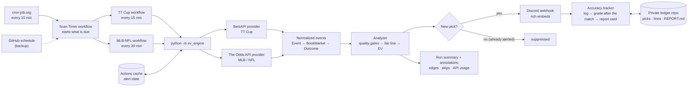

# TT Cup +EV Engine

A headless Python engine that pulls upcoming **TT Cup** table-tennis odds from **BetsAPI**, strips out the
bookmaker margin to estimate each player's true win probability, flags prices with positive expected value,
and posts them to **Discord** as rich embeds. It runs every 15 minutes on **GitHub Actions** with no server,
started by a free outside timer because GitHub's own schedule skips runs when it is busy.

**MLB and NFL** run through **The Odds API** in a second workflow (every 30 minutes, priced against Pinnacle),
with an optional Discord channel of their own.

An optional **accuracy tracker** logs every TT Cup alert and every priced match to a private repo, grades them
after the match (result, profit, closing line value) and keeps a report card that says whether the edges are
real. See [Tracking accuracy](#tracking-accuracy).

```
🔥 +5.2% EV · Kovalenko M. vs Shevchenko O.
Bet Shevchenko O. @ 2.33 on Unibet
League TT Cup · Starts 3:33 PM (in 12 minutes) · Odds 2.33 (+133) · True probability 45.2% (fair 2.21)
Fair line from: Consensus of 3 books (median, power devig)
```

---

## Architecture



```
.github/workflows/
  scan-timer.yml         pressed every 15 min by cron-job.org; starts the scanners that are due
  scan-timer-backup.yml  the same tick on GitHub's own schedule, in case the outside timer stops
  ev-scanner.yml         TT Cup: secrets → env, alert-state cache, ledger checkout + commit
  us-sports-scanner.yml  MLB / NFL: same engine, its own cache and webhook
ev_engine/
  config.py          every setting is an env var; secrets only via os.getenv
  models.py          provider-agnostic data model
  http_client.py     timeouts, retries + backoff, 429/Retry-After, quota floors, call budget
  quant.py           implied probability, 4 devig methods, EV  (pure, unit-tested)
  analyzer.py        fair line per market, quality gates, best-price selection
  providers/
    base.py          the adapter contract
    betsapi.py       TT Cup via BetsAPI (/v3/events/upcoming + /v2/event/odds/summary; /v1/event/view to grade)
    the_odds_api.py  US leagues via The Odds API v4
  notifier.py        Discord embeds, batching, rate-limit handling
  state.py           de-duplication across runs
  runner.py          one scan end to end + GitHub step summary
  tracking/
    ledger.py        the ledger files: picks, calibration lines, pending matches
    grading.py       results, profit, closing line, CLV  (pure, unit-tested)
    scorecard.py     report card: ROI + luck band, CLV verdict, calibration, book accuracy
    tracker.py       log alerts → grade finished matches → REPORT.md + weekly Discord card
tests/               192 tests, all HTTP mocked (pytest + responses)
```

---

## The math

**Implied probability and margin.** A decimal price `o` implies `q = 1/o`. Across all outcomes of a market the
implied probabilities add up to more than 1; the excess is the bookmaker's margin (the *overround*, or vig).
`1.90 / 1.90` implies 52.6% + 52.6% = 105.3%.

**Devigging** removes that margin so the probabilities sum to 1 (`DEVIG_METHOD`):

| Method | Formula | When to use |
|---|---|---|
| `multiplicative` | `p = q / Σq` | Simple and transparent |
| `additive` | `p = q − (Σq − 1)/n` | Equal margin per outcome; fails on extreme longshots |
| `power` *(default)* | `p = q^k`, with `k` solved so `Σp = 1` | Takes more margin from longshots, matching how soft books price |
| `shin` | Shin (1993) model, solved numerically | Same as additive on two-way markets; differs with 3+ outcomes |

**Expected value**, exactly as specified: `EV = (decimal_odds × true_probability) − 1`.
Alerts fire when `EV ≥ EV_THRESHOLD` (default 2%).

**Where the true probability comes from - the one rule that matters.** Devigging a book and then pricing EV
against *that same book* can never find an edge: every outcome comes out negative, by exactly `1/overround − 1`
with multiplicative devig. (`tests/test_quant.py` proves this for all four methods.) An edge only exists when one
book's price disagrees with the market's fair price, so the engine builds the fair line from *other* books:

- **sharp mode** - devig a trusted sharp book listed in `SHARP_BOOKS` (Pinnacle via The Odds API's `eu` region).
- **consensus mode** - devig every *other* book with fresh prices and take the median per outcome
  (leave-one-out, so a book is never measured against itself). Needs `MIN_CONSENSUS_BOOKS` other books.
- **auto** *(default)* - sharp when available, otherwise consensus.

BetsAPI carries **no Pinnacle odds**, and for TT Cup it carries only a few books: in October 2026,
DraftKings (every match), Bet365 (most) and FonBet (about half). The TT Cup workflow therefore sets
`MIN_CONSENSUS_BOOKS=2`: each book is priced against the average of the other two (the median of two is their
mean), so a match is priced when all three have fresh prices. `MIN_CONSENSUS_BOOKS=1` also prices matches with
only two fresh books, against that one other book: more alerts, but a single stale book is enough to fake an
edge. The **Book coverage** annotation on each run shows how many books each match had.

Most scans have only Bet365 and DraftKings fresh, which is too few for that consensus, so the TT Cup workflow
also sets `SHARP_BOOKS=Bet365`: DraftKings is priced against **Bet365's no-vig line** whenever Bet365 has a
fresh price, and Bet365 itself is still priced against a consensus of two other books. That rests each
DraftKings alert on one book's line, so the accuracy tracker reports these alerts separately (**By fair line**)
and its book-accuracy line shows whether Bet365's closing line deserves the trust. `FAIR_LINE_MODE=consensus`
switches it off.

Two things about this feed shape what you'll see. BetsAPI re-checks DraftKings' TT prices in bulk, far less
often than Bet365's or FonBet's: across 38 scans in October 2026, DraftKings' prices were 10 minutes old or less
in 17 and 11-56 minutes old in the rest. So the TT Cup workflow sets `MAX_ODDS_AGE_MIN=20`, which keeps
DraftKings in about 3 scans of 4 (instead of under half) while the long gaps stay out. The accuracy tracker's
**By price age at alert** table shows whether the 10-20 minute alerts hold up; set the variable to `10` to go
back. And with no sharp book in the mix, an "edge" means one book disagrees with the
other two, which can be the slow book (a real edge) or the one that just moved on news (not one). Check the
price at the book before betting, and track closing-line value.

**Worked example.** Three books at `1.90 / 1.90` give a 50% / 50% fair line. A fourth book offers `2.10` on
the home player: `EV = 2.10 × 0.50 − 1 = +5.0%`. The other side at `1.75`: `1.75 × 0.50 − 1 = −12.5%`.

**Quality gates.** A missing input means no alert, and the reason is logged and shown in the job summary:

| Gate | Default | Why |
|---|---|---|
| Price confirmed within `MAX_ODDS_AGE_MIN` | 10 min (TT Cup: 20) | stale prices make phantom edges |
| Reference margin between 1.00 and `MAX_OVERROUND` | 1.12 | junk margins make a junk fair line |
| At least `MIN_CONSENSUS_BOOKS` other books (unless a sharp book is present) | 3 (TT Cup: 2) | thin markets are noise |
| `EV ≤ MAX_EV` | 15% | bigger "edges" are almost always reversed or mismatched data |
| Price between `MIN_ODDS` and `MAX_ODDS` | 1.10-5.00 | devig error grows on longshots |
| Match starts in at least `MIN_MINUTES_TO_START` | 2 min | no time to bet |
| Pre-match prices only | - | in-play snapshots are ignored |

Bookmakers that list the players in reverse order (BetsAPI `matching_dir = -1`) are swapped back, suspended
prices (`0.00`) are dropped, and split Asian lines (`2.5,3.0`) are ignored.

---

## Deploy on GitHub Actions (about 10 minutes)

### 1. Push the code to a GitHub repository
Create a repository and push this folder. Public or private both work; see **Cost** below before choosing.

### 2. Create a Discord webhook
Discord → **Server Settings → Integrations → Webhooks → New Webhook** → pick the alerts channel →
**Copy Webhook URL**. Treat it like a password: anyone holding it can post to that channel.

### 3. Add the repository secrets
Repository → **Settings → Secrets and variables → Actions → Secrets → New repository secret**:

| Name | Value |
|---|---|
| `BETSAPI_TOKEN` | your BetsAPI token (needs a package that includes the table-tennis Events API) |
| `DISCORD_WEBHOOK_URL` | the URL from step 2 |
| `THE_ODDS_API_KEY` | for the MLB/NFL workflow |
| `DISCORD_WEBHOOK_URL_US` | *(optional)* a second webhook so MLB/NFL alerts get their own channel |

Or with the GitHub CLI, which prompts for the value so it stays out of your shell history:

```bash
gh secret set BETSAPI_TOKEN
gh secret set DISCORD_WEBHOOK_URL
```

The workflow passes secrets to the engine as environment variables, which it reads with `os.getenv`. Nothing
secret is in the code, GitHub masks secret values in the logs, and the engine also scrubs them from every log
line itself.

### 4. (Optional) Tune with repository variables
Same page → **Variables** tab → **New repository variable**, e.g. `EV_THRESHOLD = 0.03` or
`BET_BOOKS = Bet365,Betway` (only recommend books you can bet at). CLI: `gh variable set EV_THRESHOLD --body 0.03`.
Any variable you don't set falls back to the defaults in `ev_engine/config.py`.

### 5. Test it
**Actions** tab → enable workflows if asked → **TT Cup EV Scanner** (or **MLB-NFL EV Scanner**) → **Run workflow**:

1. Tick **Only post one sample alert** and untick **Dry run** → a 🧪 TEST embed should land in Discord.
2. Run again with **Dry run** ticked → the job log shows exactly what would be posted, and the run page shows a
   summary of events scanned, edges, skip reasons and API usage.
3. Something looks off (say, every match skipped as stale)? Run with **Diagnostics: show the raw odds** ticked.
   Each of the next 3 matches becomes an annotation listing every bookmaker's prices, when each was posted and
   when the API last checked it. Nothing is posted to Discord.

After that the timer takes over (step 7): timer runs always post for real. Every run also leaves a one-line
**EV scan** annotation on its run page (events, edges, alerts, API calls and credits left), and any error shows
there too, so you rarely need to open the logs. A second **Book coverage** annotation shows how many books
priced each match and which ones, the first thing to check if matches are skipped with
"No fair line (too few books)". A **Settings** annotation lists which books picks come from and every
setting you changed with a repository variable, so you can confirm a change took effect. While a workflow's secrets are missing it doesn't fail: it
finishes green with a **Scanner idle** warning naming the missing secret.

### 6. Pin the league (recommended)
The first runs log a line like `matched leagues TT Cup [22742]. Tip: set BETSAPI_LEAGUE_IDS=22742`.
Setting that variable skips the sport-wide fixture scan and saves API calls.

### 7. Start the outside timer (recommended)
GitHub treats `schedule:` as best effort: on this project's first full day only 14 of about 68 TT Cup scans
ran, with gaps of up to five hours. So the scanners have no schedule of their own. Instead the **Scan Timer**
workflow starts whichever scanner is due (TT Cup every 15 minutes, MLB/NFL every 30), and a free
[cron-job.org](https://cron-job.org) job presses its "Run workflow" button every 15 minutes:

1. Create a fine-grained token at <https://github.com/settings/personal-access-tokens/new>: repository access
   *Only select repositories* → this repo; repository permission **Actions: Read and write**; nothing else.
   It can start and cancel this repo's workflow runs, but can't read your secrets or change code.
2. On cron-job.org, create a job that runs every 15 minutes:
   - URL `https://api.github.com/repos/<owner>/<repo>/actions/workflows/scan-timer.yml/dispatches`
   - Advanced → method `POST`, headers `Authorization: Bearer <token>`, `Accept: application/vnd.github+json`,
     `Content-Type: application/json`, body `{"ref":"main"}`
   - Turn on the failure email, then **Test run**: GitHub answers `204 No Content`.

Until the job exists, `scan-timer-backup.yml` runs the same tick on GitHub's schedule, and it keeps doing so
as a backup. Each tick checks when each scanner last ran a live scan, so the backup and the timer never double
up. Runs are titled by type in the Actions list ("TT Cup scan", "TT Cup scan (dry run)", "TT Cup test alert"),
and only live scans count, so testing by hand never holds back a scheduled scan.
`TT_SCAN_EVERY_MIN` / `US_SCAN_EVERY_MIN` (multiples of 15) change the pace, e.g. `US_SCAN_EVERY_MIN=60`
halves the Odds API credits.

---

## Tracking accuracy

Results alone take thousands of bets to separate skill from luck. The tracker measures the things that answer
sooner, for every TT Cup alert and for every match the scanner priced:

| What | Answers | Readable after |
|---|---|---|
| **Closing line value (CLV)** | Did the alerted price beat the fair line at kickoff? The best early sign that an edge is real | ~20-50 alerts |
| **Calibration** | When the fair line says 60%, does that player win ~60%? (every priced match, alert or not) | ~200 matches (a few days) |
| **Book accuracy** | Whose closing line is closest to the results (a candidate for `SHARP_BOOKS`) | ~200 matches |
| **Profit / ROI** | Each pick as a 1-unit bet at its first alert's price (re-alerts aren't counted twice), with the luck band at that sample size | thousands of alerts |

CLV is `price × p_close − 1`, where `p_close` is the closing fair line built exactly like the alert's (the
*other* books' kickoff prices, no-vig with `DEVIG_METHOD`, median). Only books whose prices were fresh at the last
scan before the start count: a book BetsAPI stopped refreshing still reports a "closing" price, often its
hours-old opener. Each scan logs its alerts and its matches;
about `SETTLE_AFTER_MIN` (40) minutes after a match starts, a later scan fetches the final score and every
book's closing price and grades it. Retired, walkover and cancelled matches void their picks.

### Setup (5 minutes)
1. Create a **private** repo named `tt-ev-ledger` at <https://github.com/new>, with **Add a README file** ticked
   (an empty repo can't be checked out). Another name works too: set the `LEDGER_REPO` variable to `owner/name`.
2. Create a fine-grained token at <https://github.com/settings/personal-access-tokens/new>: repository access
   *Only select repositories* → `tt-ev-ledger`; repository permission **Contents: Read and write**; nothing else.
3. In this repo add it as the secret **`LEDGER_TOKEN`**.

The next scan starts tracking. Until the secret exists the scanner works as before and each run shows a
"Tracker off" note; if the token expires, runs show "Tracker off" again and alerts carry on.

### What you get
- **`REPORT.md`** in the ledger repo: the live report card (verdicts, results by book / EV / price age,
  calibration table, recent alerts), refreshed after every scan.
- A **weekly report card** in your Discord channel (Mondays 16:00 UTC = 9am Phoenix; `REPORT_DAY` /
  `REPORT_HOUR_UTC`). To get one now: Actions → TT Cup EV Scanner → Run workflow, untick *Dry run*, tick
  *Post the accuracy tracker's report card*.
- **CSV files** you can open in any spreadsheet: `picks/YYYY-MM.csv` (one row per alert, graded in place) and
  `lines/YYYY-MM/YYYY-MM-DD.csv` (every graded match with each book's closing prices).
- A **Tracker** note on every run (what was logged and graded, BetsAPI calls used).

Cost: about one extra BetsAPI call per finished match (plus one per 10 matches for the scores), capped at
`TRACKER_MAX_CALLS` per run. Dry runs, test alerts and diagnostics are never logged.

---

## Configuration

Every setting is an environment variable (a repository variable in Actions, or a line in `.env` locally).
Each workflow pins its own source (`ENABLED_PROVIDERS`), so the TT Cup and MLB/NFL scanners never interfere.
The MLB/NFL workflow reads `US_`-prefixed variables for its tunables (`US_BET_BOOKS`, `US_EV_THRESHOLD`,
`US_MIN_ODDS`, `US_MAX_ODDS`, `US_SHARP_BOOKS`, `US_MAX_ALERTS_PER_RUN`), so you can tune it without touching
TT Cup.

| Variable | Default | Meaning |
|---|---|---|
| `ENABLED_PROVIDERS` | `betsapi_tt` | set by each workflow: `betsapi_tt` or `the_odds_api` |
| `EV_THRESHOLD` | `0.02` | minimum EV to alert (0.02 = 2%) |
| `STRONG_EV_THRESHOLD` | `0.05` | darker green + 🔥 at or above this |
| `MAX_EV` | `0.15` | EV above this is treated as bad data |
| `DEVIG_METHOD` | `power` | `multiplicative`, `additive`, `power`, `shin` |
| `FAIR_LINE_MODE` | `auto` | `auto`, `sharp`, `consensus` |
| `SHARP_BOOKS` | *(empty)*; TT Cup workflow: `Bet365` | priority list of books whose no-vig line is the fair line, e.g. `pinnacle` |
| `MIN_CONSENSUS_BOOKS` | `3` (TT Cup workflow: `2`) | other books needed for a consensus line (lower = more alerts, more noise) |
| `MAX_OVERROUND` | `1.12` | books with a larger margin stay out of the fair line |
| `MIN_ODDS` / `MAX_ODDS` | `1.10` / `5.00` | only alert prices in this range |
| `MAX_ODDS_AGE_MIN` | `10` (TT Cup workflow: `20`) | ignore prices not confirmed this recently |
| `MIN_MINUTES_TO_START` | `2` | skip matches about to start |
| `BET_BOOKS` | *(empty = any)*; both workflows default to your sportsbooks | only recommend these books |
| `MAX_ALERTS_PER_RUN` | `20` | flood guard; extra edges wait for the next run |
| `REALERT_EV_DELTA` | `0.01` | re-alert a pick only if its EV rises by this much |
| `TT_LEAGUES` | `TT Cup` | league-name filter (substring, comma list) |
| `BETSAPI_LEAGUE_IDS` | *(empty)* | fetch these league IDs directly |
| `BETSAPI_MARKETS` | `92_1` | `92_1` winner, `92_2` handicap, `92_3` total |
| `BETSAPI_LOOKAHEAD_MIN` | `180` | how far ahead to look for matches |
| `BETSAPI_MAX_EVENTS` / `BETSAPI_MAX_CALLS` | `60` / `150` | per-run caps |
| `BETSAPI_MIN_REMAINING` | `100` | stop when the hourly allowance gets this low |
| `BETSAPI_BASE_URL` | `https://api.b365api.com` | BetsAPI's backup endpoint is `https://api.betsapi.com` |
| `ODDS_API_SPORTS` | `baseball_mlb,americanfootball_nfl` | The Odds API sport keys |
| `ODDS_API_REGIONS` / `ODDS_API_MARKETS` | `us,eu` / `h2h` | each region × market costs a credit per call |
| `ODDS_API_BOOKMAKERS` | *(empty)*; MLB-NFL workflow: Pinnacle + your books | named books instead of regions; every 10 books cost one region |
| `ODDS_API_LOOKAHEAD_MIN` / `ODDS_API_MIN_REMAINING` | `1440` (workflow: `4320`) / `50` | window and monthly-credit floor |
| `DRY_RUN` / `LOG_LEVEL` | `false` / `INFO` | |
| `LEDGER_REPO` | `<owner>/tt-ev-ledger` | private repo for the accuracy tracker (needs the `LEDGER_TOKEN` secret) |
| `SETTLE_AFTER_MIN` / `SETTLE_GIVE_UP_HOURS` | `40` / `12` | when to first look for a result, and when to stop waiting |
| `TRACKER_MAX_CALLS` | `40` | BetsAPI calls per run for grading |
| `REPORT_DAY` / `REPORT_HOUR_UTC` | `mon` / `16` | weekly report card in Discord (`REPORT_DAY=off` to stop it) |

Handicap and total markets (`92_2`, `92_3`) are off by default: books mix set and point handicaps, and lines
only match across books when the number is identical.

---

## Rate limits and cost

- **BetsAPI**: 3,600 requests per hour by default. A run makes one call per fixture page plus one per match
  (about 10-70). The client reads `X-RateLimit-Remaining`, stops at `BETSAPI_MIN_REMAINING`, never exceeds
  `BETSAPI_MAX_CALLS`, honours `Retry-After` on HTTP 429, and treats `TOO_MANY_REQUESTS` as "stop for this run".
- **The Odds API**: each call costs *markets × regions* credits per sport, whatever the number of games, and
  naming bookmakers instead counts every 10 books as one region. The MLB-NFL workflow names 7 books (Pinnacle
  plus your sportsbooks), so with h2h, two sports and a run every 30 minutes it costs 2 credits a run, about
  2,900 a month; a sport with no games listed costs nothing. That needs a paid plan (the free tier is 500
  credits a month). Running every 15 minutes doubles it; adding spreads and totals triples it. The engine stops
  calling when credits left reach `ODDS_API_MIN_REMAINING`.
- **Discord**: on HTTP 429 the notifier waits `retry_after` and retries; when the bucket is empty it waits
  `X-RateLimit-Reset-After`; up to 10 embeds and 6,000 characters per message; a 404 (deleted webhook) stops
  delivery and fails the run.
- **GitHub Actions minutes**: free for public repositories. A private repository on GitHub Free includes 2,000
  minutes a month, and every run bills at least one minute, so the timer ticks and scans (several thousand
  short runs a month) go well over. Keep the repo public (secrets stay encrypted) or pay for the overage.
- **Timing**: GitHub's own schedule runs late or drops runs when it is busy, which is why an outside timer
  starts the scans (step 7). In public repositories GitHub disables *scheduled* workflows after 60 days without
  a commit; only the backup is scheduled, so that never stops the outside timer (re-enable the backup from the
  Actions tab if it happens). If the timer's token expires, cron-job.org emails you and the backup carries on.

**De-duplication.** Each runner is a fresh machine, so each workflow restores its alert state from the Actions
cache before the scan and saves it afterwards (TT Cup and MLB/NFL keep separate state). A pick alerts once, and
again only if its EV improves by `REALERT_EV_DELTA`. Picks that failed to send are not remembered, so they
retry next run.

**Exit codes.** `0` ok (including "no edges"), `1` a provider or Discord failed (the run turns red and GitHub
emails you), `2` configuration error.

---

## MLB / NFL

`.github/workflows/us-sports-scanner.yml` runs the same engine against The Odds API every 30 minutes
(every second Scan Timer tick), looking up to 3 days ahead so NFL games show up from midweek.

1. Add the `THE_ODDS_API_KEY` secret (and `DISCORD_WEBHOOK_URL_US` for a separate channel).
2. Optional variables: `US_BET_BOOKS` = the US books you can bet at (the workflow defaults to DraftKings,
   FanDuel, BetMGM, Caesars, Hard Rock and Bally Bet), `ODDS_API_BOOKMAKERS` = the books to download
   (defaults to those plus Pinnacle; keys are listed on The Odds API's bookmakers page), `US_EV_THRESHOLD`,
   `ODDS_API_MARKETS = h2h,spreads,totals` (3× the credits). Caesars is only returned on paid plans.
3. Run **MLB-NFL EV Scanner** with **Dry run** ticked to see the first scan.

The fair line is Pinnacle's no-vig price whenever Pinnacle lists the game (`US_SHARP_BOOKS` changes this),
otherwise a consensus of the other downloaded books. To change the cadence, set `US_SCAN_EVERY_MIN`
(a multiple of 15).

**Another data source**: subclass `OddsProvider` in `ev_engine/providers/`, return normalized `Event`s, and add
the class to `REGISTRY` in `providers/__init__.py`. The analyzer, notifier and state need no changes.

**Your own model's probabilities**: `_fair_line()` in `analyzer.py` is the single place where "true probability"
is decided. Return a `FairLine` built from model probabilities there to price edges against a model instead of
the market.

---

## Local development

```bash
python -m venv .venv && source .venv/bin/activate
pip install -r requirements-dev.txt
cp .env.example .env              # fill in your token + webhook; .env is git-ignored
python -m ev_engine --test-alert  # one sample embed to Discord
python -m ev_engine --dry-run     # full scan, payloads printed instead of posted
python -m ev_engine --inspect     # raw odds for the next 3 matches (diagnostics)
pytest                            # 192 tests, no network needed
```

---

## Caveats

A consensus fair line is an estimate. Thin markets, feeds that lag the books, and late lineup or table changes
all create edges that aren't real, which is what the gates above are for. Let the accuracy tracker show the
alerts beating the closing line before staking real money; CLV is measured at the alerted price, so a price
that was already gone when you clicked counts for less than it shows. This is a tool, not financial advice; make sure sports betting is legal where
you are and that you follow each sportsbook's terms.
